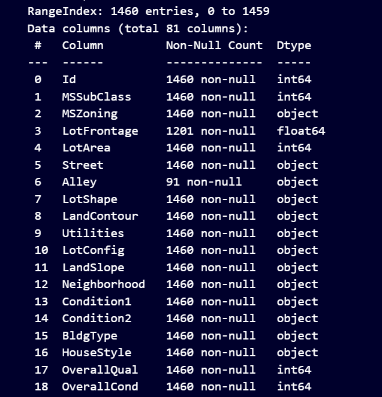

# Project Title
# ╔════════════════════════════════════════════════════╗
# ║ 🏠 Housing price prediction - Kaggle Challenge  ║
# ║ 📊 Machine Learning in Python                      ║
# ║ 🛠️  By: Nishkarsh Pandey(Nish2005karsh)                    ║
# ╚════════════════════════════════════════════════════╝

## 👤 Authors

- **Nishkarsh Pandey** ⇒ [@Nish2005karsh](https://www.github.com/Nish2005karsh)
## 📎 Appendix
A. Dataset Source
The dataset used is the Titanic - Machine Learning from Disaster dataset provided by `Kaggle`.

Files used:
`sample_submission.csv`: a file in the proper format to be submitted.

`train.csv`: for training and evaluation.

`test.csv`: optional, for model testing and prediction.

B. Tools and Technologies
Language: `Python 3.x` 🐍

Libraries:

`pandas, numpy` — for efficient data manipulation and numerical computations.

`matplotlib, seaborn` — for exploratory data visualization and plotting.

`scikit-learn`— for building and evaluating machine learning models.

`jupyter` — for interactive development and prototyping.

`streamlit` — for deploying the predictive model as a user-friendly web application.

***Development Environment***:

`Jupyter Notebook` — interactive analysis and model building.

`Visual Studio Code` — code editing and project management.

`Web browser` — to run and interact with the `Streamlit`app locally or on a server.
## Screenshots

## Features

| Feature        | Type                  | Description                                                       |
| -------------- | --------------------- | ----------------------------------------------------------------- |
| `Id`           | Numerical             | Unique identifier for each house (not used for prediction)        |
| `MSSubClass`   | Categorical (Ordinal) | The building class/type of the house                              |
| `MSZoning`     | Categorical           | The general zoning classification (e.g., Residential, Commercial) |
| `LotFrontage`  | Numerical             | Linear feet of street connected to the property                   |
| `LotArea`      | Numerical             | Lot size in square feet                                           |
| `Street`       | Categorical           | Type of road access to property (e.g., Pave, Gravel)              |
| `OverallQual`  | Numerical             | Overall material and finish quality (1-10 scale)                  |
| `OverallCond`  | Numerical             | Overall condition rating (1-10 scale)                             |
| `YearBuilt`    | Numerical             | Original construction year                                        |
| `YearRemodAdd` | Numerical             | Remodel year (same as YearBuilt if no remodeling)                 |
| `RoofStyle`    | Categorical           | Type of roof (e.g., Gable, Hip)                                   |
| `Exterior1st`  | Categorical           | Exterior covering on house (e.g., Vinyl, Brick)                   |
| `ExterQual`    | Categorical           | Exterior material quality (e.g., Excellent, Good, Typical)        |
| `BsmtQual`     | Categorical           | Basement height quality (e.g., Excellent, Good, None)             |
| `TotalBsmtSF`  | Numerical             | Total square feet of basement area                                |
| `HeatingQC`    | Categorical           | Heating quality and condition                                     |
| `CentralAir`   | Categorical           | Central air conditioning (Y = Yes, N = No)                        |
| `1stFlrSF`     | Numerical             | First floor square feet                                           |
| `2ndFlrSF`     | Numerical             | Second floor square feet                                          |
| `GrLivArea`    | Numerical             | Above ground living area (sum of 1st and 2nd floor)               |
| `FullBath`     | Numerical             | Number of full bathrooms                                          |
| `HalfBath`     | Numerical             | Number of half bathrooms                                          |
| `BedroomAbvGr` | Numerical             | Number of bedrooms above ground                                   |
| `KitchenQual`  | Categorical           | Kitchen quality rating                                            |
| `TotRmsAbvGrd` | Numerical             | Total rooms above ground (excluding bathrooms)                    |
| `Fireplaces`   | Numerical             | Number of fireplaces                                              |
| `GarageType`   | Categorical           | Garage location/type (e.g., Attached, Detached)                   |
| `GarageCars`   | Numerical             | Size of garage in car capacity                                    |
| `GarageArea`   | Numerical             | Size of garage in square feet                                     |
| `SalePrice`    | Numerical (Target)    | Sale price of the house (target variable)                         |

