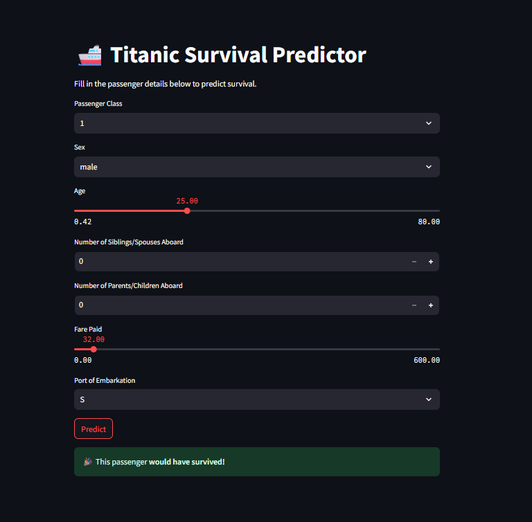
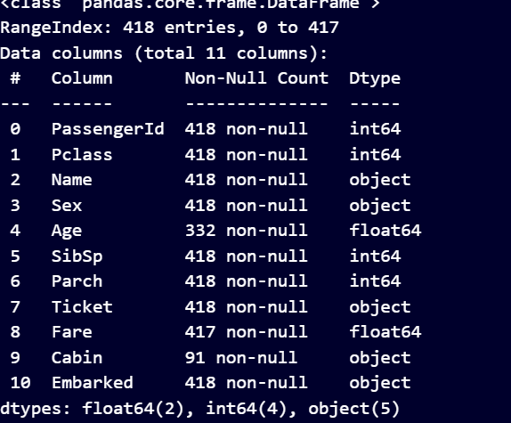

# Project Title
# ╔════════════════════════════════════════════════════╗
# ║ 🚢 Titanic Survival Prediction - Kaggle Challenge  ║
# ║ 📊 Machine Learning in Python                      ║
# ║ 🛠️  By: Nishkarsh Pandey(Nish2005karsh)                    ║
# ╚════════════════════════════════════════════════════╝

## 👤 Authors

- **Nishkarsh Pandey** ⇒ [@Nish2005karsh](https://www.github.com/Nish2005karsh)
## 📎 Appendix
A. Dataset Source
The dataset used is the Titanic - Machine Learning from Disaster dataset provided by `Kaggle`.

Files used:

`train.csv`: for training and evaluation.

`test.csv`: optional, for model testing and prediction.

B. Tools and Technologies
Language: `Python 3.x` 🐍

Libraries:

`pandas, numpy` — for efficient data manipulation and numerical computations.

`matplotlib, seaborn` — for exploratory data visualization and plotting.

`scikit-learn`— for building and evaluating machine learning models.

`jupyter` — for interactive development and prototyping.

`streamlit` — for deploying the predictive model as a user-friendly web application.

***Development Environment***:

`Jupyter Notebook` — interactive analysis and model building.

`Visual Studio Code` — code editing and project management.

`Web browser` — to run and interact with the `Streamlit`app locally or on a server.
## Screenshots

    
## Features

| Feature       | Type                  | Description                                                         |
| ------------- | --------------------- | ------------------------------------------------------------------- |
| `PassengerId` | Numerical             | Unique ID for each passenger (not useful for prediction)            |
| `Pclass`      | Categorical (Ordinal) | Passenger class (1st = 1, 2nd = 2, 3rd = 3) – socioeconomic status  |
| `Name`        | Text                  | Full name – can be used to extract titles like Mr, Mrs, Miss, etc.  |
| `Sex`         | Categorical           | Gender of passenger (male/female)                                   |
| `Age`         | Numerical             | Age in years (has missing values)                                   |
| `SibSp`       | Numerical             | Number of siblings or spouses aboard                                |
| `Parch`       | Numerical             | Number of parents or children aboard                                |
| `Ticket`      | Text                  | Ticket number (can be used to find shared fares/families)           |
| `Fare`        | Numerical             | Fare paid for the ticket                                            |
| `Cabin`       | Text                  | Cabin number (many missing values)                                  |
| `Embarked`    | Categorical           | Port of embarkation: C = Cherbourg, Q = Queenstown, S = Southampton |
| `Survived`    | Binary (Target)       | 0 = Did not survive, 1 = Survived (label)                           |

